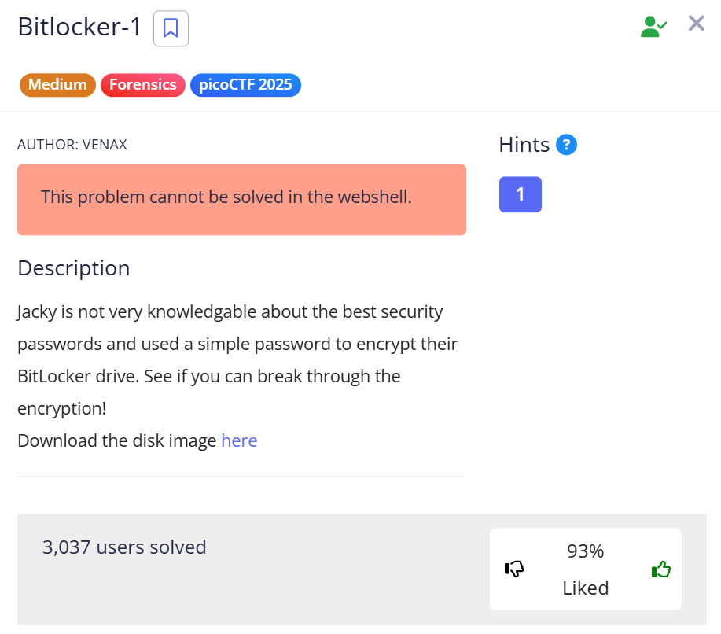

**Goal:** Break into a BitLocker-encrypted disk image by cracking a weak user password and recover the hidden flag.


---

## Challenge Description


Screenshot from the picoCTF challenge page:





---


## Challenge Overview


This challenge focuses on BitLocker disk encryption and what happens when users protect it with a weak password. The disk image itself is encrypted, so the first step isn’t file browsing — it’s cracking the BitLocker password.


Once the password is recovered, the image can be unlocked normally and inspected like any other filesystem.


---


## Solution


### 1) Extract the BitLocker hash


I started by extracting BitLocker hashes from the disk image using `bitlocker2john`.


```bash

bitlocker2john bitlocker-1.dd

```


This output several hashes, but the one we care about is the **user password hash**. I copied that hash and saved it to a file called `bitlocker.hash`.


---


### 2) Crack the password with hashcat


With the hash saved, I used `hashcat` in BitLocker mode (`-m 22100`) along with the `rockyou.txt` wordlist.


```bash

hashcat -m 22100 bitlocker.hash /usr/share/wordlists/rockyou.txt

```


The password was cracked almost immediately: **`jacqueline`**.


---


### 3) Unlock the disk image in Autopsy


Next, I loaded the disk image into **Autopsy**. When adding the data source, Autopsy prompts for an optional BitLocker password. I entered the cracked password (`jacqueline`), and the filesystem unlocked successfully.


---


### 4) Locate the flag


Once decrypted, the filesystem was fully accessible. The flag file (`flag.txt`) was sitting directly at the root of the disk image.


---


## Flag


`picoCTF{us3_b3tt3r_p4ssw0rd5_pl5!_3242adb1}`


This challenge is a textbook example of why full-disk encryption is only as strong as the password protecting it.


---


## Tools Used


\- `bitlocker2john` (hash extraction)

\- `hashcat` + `rockyou.txt` (password cracking)

\- Autopsy (BitLocker decryption and filesystem browsing)


---