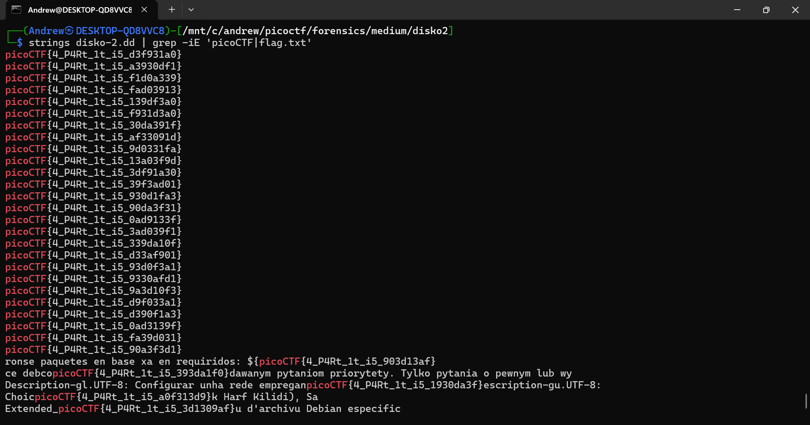

+++
date = '2026-01-30T02:46:17-05:00'
title = 'Disko 2'
+++

**Goal:** Recover the *real* flag from a disk image (`.dd`) full of convincing decoys — and follow the hint: **“the right one is Linux.”**

---

## Challenge Description

Screenshot from the picoCTF challenge page:


---

## Challenge Overview

This challenge starts out feeling just like **DISKO 1**: you’re given a disk image, so a quick `strings` search seems like it should work. Except this time… it works *too* well. I got a whole pile of “flags” with slightly different endings — classic decoy spam.

The description basically points you in the right direction: **the correct partition is Linux**. So instead of trusting the raw `strings` output, the winning move is to isolate the Linux volume and search inside the proper filesystem context.

---

## Solution

### 1) Quick check: `strings` (and why it wasn’t enough)

My first attempt was the same approach that worked on DISKO 1: run `strings` on the disk image and grep for `picoCTF` / `flag.txt`. But this time, it returned *many* lookalike flags with slightly different suffixes.

```bash
strings disko-2.dd | grep -iE 'picoCTF|flag.txt'
```



**Takeaway:** `strings` is great for fast triage, but on a disk image it can pull in tons of unrelated text from multiple partitions (including decoys). Time to narrow the scope.

---

### 2) Open the disk image in Autopsy and identify the Linux partition

Next, I loaded the `.dd` into **Autopsy** to get a clean view of the partition layout. In the left pane, Autopsy showed **four volumes**. Based on the labels (and the challenge hint), **Volume 2** stood out as the Linux partition.


This is the “hint moment”: the correct flag should be inside the Linux volume, not floating around randomly in the whole image.

---

### 3) View the Linux volume and hunt inside its text

Once I had the correct partition, I right-clicked the Linux volume and chose **View in New Window**. Then I switched to the **Text** tab and paged through until I found a single clean flag entry (not one of the many decoys).


---

## Flag

`picoCTF{4_P4Rt_1t_i5_90a3f3d1}`

**Lesson learned:** when a disk image is noisy, don’t grep the entire blob forever — isolate the correct partition first, then search where the data is actually supposed to live.

---

## Tools Used

- `strings` (quick triage / sanity check)
- `grep` (filtering candidate strings)
- Autopsy (partition identification + filesystem-aware browsing)