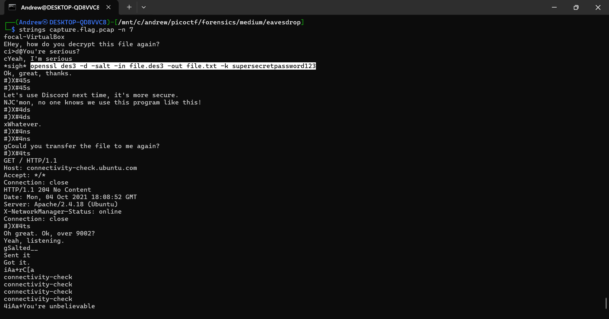

+++
date = '2026-01-30T02:25:38-05:00'
title = 'Eavesdrop'
+++

**Goal:** Extract an encrypted blob transferred over TCP, then decrypt it using an OpenSSL command leaked in plaintext chat.

---

## Challenge Description

Screenshot from the picoCTF challenge page:


---

## Challenge Overview

This PCAP contains two things:

- a plaintext “chat” embedded inside packet data
- a short file transfer that contains the encrypted flag

You *can* read the chat directly in Wireshark’s ASCII pane, but the fastest workflow is to run `strings` on the capture first. That quickly reveals an OpenSSL decrypt command (including the password), which tells us exactly how the transferred file needs to be decrypted.

---

## Solution

### 1) Triage the PCAP with `strings`

First, I pulled readable text out of the capture. I used `-n 7` to reduce short/noisy matches and keep the useful lines. This immediately surfaced a plaintext conversation, including an OpenSSL command and the password: `supersecretpassword123`.

```bash
strings capture.flag.pcap -n 7
```



---

### 2) Confirm the plaintext chat in Wireshark (ASCII pane)

To verify where that text lives inside the capture, I opened the PCAP in Wireshark and inspected packet bytes. The conversation is visible directly in the ASCII pane of relevant packets (so this is another valid way to discover the decrypt command).


---

### 3) Locate the file transfer (port `9002`)

In the chat, the sender mentions transferring the file over port `9002`. Since the capture is small (~75 packets), it’s quick to scroll/filter until the packets involving `9002` appear. The actual payload transfer happens in packet 57.


---

### 4) Follow the TCP stream and save the raw payload

I right-clicked packet 57 and used **Follow → TCP Stream** to isolate the transferred data. In the stream window, I set *Show as* to **Raw**, then clicked **Save as…** and saved it locally. I named the saved file `encrypted`.


---

### 5) Decrypt with OpenSSL and read the flag

Finally, I reused the command from the chat and pointed `-in` to my saved file (`encrypted`), outputting to `flag.txt`. The OpenSSL warning about deprecated key derivation can be ignored for this challenge.

```bash
openssl des3 -d -salt -in encrypted -out flag.txt -k supersecretpassword123
cat flag.txt
```


---

## Flag

`picoCTF{nc_73115_411_5786acc3}`

---

## Tools Used

- `strings` (quickly extract the plaintext chat + decrypt command from the PCAP)
- Wireshark (inspect packets, identify port `9002`, and extract the payload via Follow TCP Stream)
- OpenSSL (decrypt the saved payload using the leaked password)