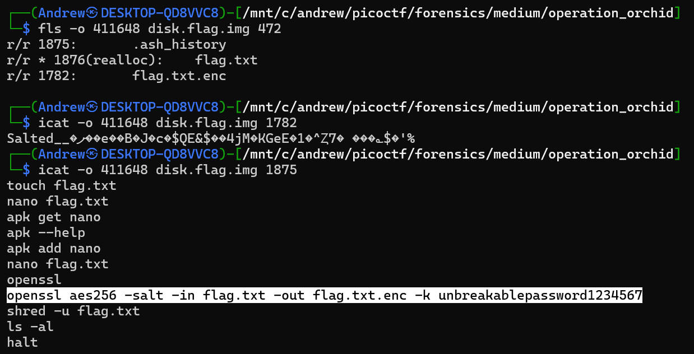

+++
title = "Operation Orchid"
date = 2026-01-30T01:40:38-05:00
+++

**Goal:** Recover the flag from a disk image by locating an encrypted flag file, extracting the encryption password from shell history, and decrypting it with OpenSSL.

---

## Challenge Description

Screenshot from the picoCTF challenge page:


---

## Challenge Overview

This is a disk image forensics challenge. The trick is that the flag isn’t sitting in plaintext — it’s stored as an encrypted file, and the password is leaked in the user’s shell history (`.ash_history`).

Workflow: decompress the image, identify the Linux partition/offset, browse the filesystem with SleuthKit, pull the encrypted file + history, then decrypt using the recovered password.

---

## Solution

### 1) Decompress and find the Linux partition offset

After downloading the `.gz`, decompress it, then list partitions with `mmls`. The partition we care about starts at sector `411648`, which becomes the offset used for all SleuthKit file listing/extraction.

```bash
gunzip disk.flag.img.gz
mmls disk.flag.img
fls -o 411648 disk.flag.img
```


---

### 2) Browse the filesystem and locate the encrypted flag + command history

List the filesystem with `fls` using the offset. From there, check the root directory (inode `472`). In root, you’ll find: `flag.txt.enc` (encrypted flag) and `.ash_history` (shell history with the encryption command + password).

```bash
fls -o 411648 disk.flag.img 472
icat -o 411648 disk.flag.img 1875
```



---

### 3) Extract the encrypted flag to your machine

Now that we know the inode for the encrypted file (`flag.txt.enc`), use `icat` to save it locally.

```bash
icat -o 411648 disk.flag.img 1782 > flag.txt.enc
ls
```


---

### 4) Decrypt with the leaked password (even if it prints “bad decrypt”)

The shell history shows the exact OpenSSL command used to encrypt the flag, including the password. To decrypt, add `-d` and swap the input/output files accordingly.

```bash
openssl aes256 -d -salt -in flag.txt.enc -out flag.txt -k unbreakablepassword1234567
cat flag.txt
```

**Note:** OpenSSL may print `bad decrypt`, but it still outputs a readable `flag.txt` here.


---

## Flag

`picoCTF{h4un71ng_p457_5113beab}`

---

## Tools Used

- `gunzip` (decompress the provided disk image)
- `mmls` (identify partitions + find the correct offset)
- `fls` (browse directories/inodes in the filesystem)
- `icat` (extract files from the image by inode)
- `openssl` (decrypt `flag.txt.enc` using the leaked password)

---